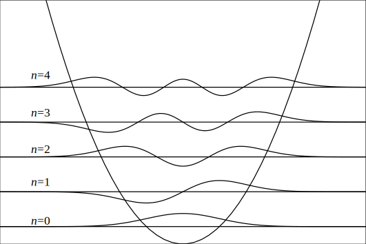

# theor.chem.primers
Some codes for training young theoretical chemists

## Quantum Harmonic Oscillator
`qho.f`: This files contains some codes to generate the wavefunction of Quantum Harmonic Oscillator, which can be used as basis set to solve some 1D quantum oscillators eigenproblems.  And using some plot tools (I use Veusz here), you get this:

